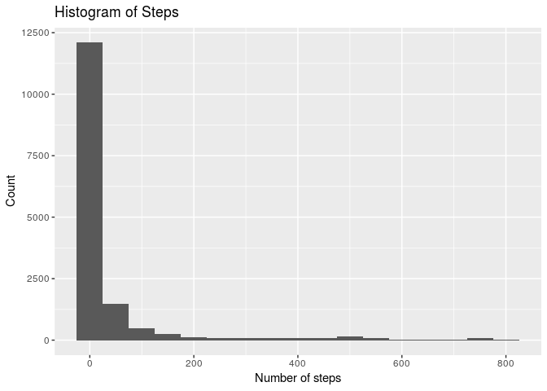
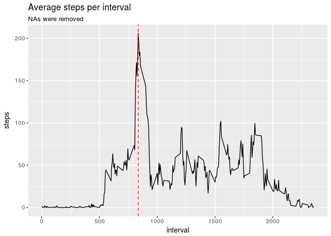
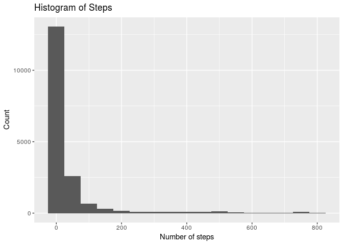
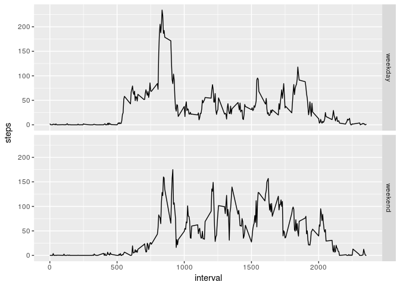

Reproducible Reseach - week 2
================
pokasombra
May 2, 2018

First we need to unip the files, and then, read the table:

``` r
unzip("activity_data.zip")
adata <- read.csv("activity.csv")
```

We then calculate the sum, mean and medan of steps into R objects,
so that we can use them to include the values into the text with \`r

``` r
total_steps <- sum(adata$steps, na.rm = TRUE)
mean_steps <- mean(adata$steps, na.rm = TRUE)
median_steps <- median(adata$steps, na.rm = TRUE)
```

The total number of steps is indicated by the `total_steps` object: **570608** The histogram of the steps - we subset the data so that NA values are removes:

``` r
library(ggplot2)
qplot(adata$steps[!is.na(adata$steps)], main = "Histogram of Steps",
      xlab = "Number of steps", ylab = "Count", binwidth = 50)
```



With the Histogram above, it is no surpirse that the *median* of the steps is **0**, and the mean is **37.3825996**.

**plotting an average daily pattern**: In order to plot an average daily pattern, we need to aggregate the values of every unique interval. One way to do this is using the aggregate function.

``` r
average_interval <- aggregate(formula = steps ~ interval, data = adata, FUN = mean, na.rm = TRUE)
ggplot(average_interval) + geom_line(aes(x = interval, y = steps)) + labs(title = "Average steps per interval", subtitle = "NAs were removed") + geom_vline(xintercept = average_interval$interval[which.max(average_interval$steps)], col = "red", linetype = "dashed")
```



The time interval with the maximum number of steps is *835*, as indicated by the red dotted line in the time series above. This value was obtained by the formula `average_interval$interval[which.max(average_interval$steps)]`.

*Working with NAs*:
There are a number of NAs in the series. To be precise, there are 2304 rows with NA in the steps. (obtained with `sum(is.na(adata$steps))`).
The strategy adopted to fill this elements is to use the average steps for the interval. The whole dataset can be obtained using the code:

``` r
adata2 <- adata
for(i in unique(adata$interval)) {
  adata2$steps[adata2$interval == i][is.na(adata2$steps[adata2$interval == i])] <- average_interval[average_interval$interval == i, "steps"]
}
rm(i)
```

After this, we can use `sum(is.na(adata2$steps))` to see the number of NAs in `adata2`: **0**
Now, with the new, NA isempt, dataset, we can create a New Histogram:

``` r
qplot(adata2$steps, main = "Histogram of Steps",
      xlab = "Number of steps", ylab = "Count", binwidth = 50)
```



The new average is **37.3825996**, and the new median is **0**.

Since we used the averade results to input the NA rows, it is no surprise that the "new" median and mean are exactly the same as before (in fact, it would be strange if it wasnt!).
Maybe using another method would produce different results.

*Weekdays*: To see weekdays, we need to create a column that indicates which date of the week it is, then, we transform them to only "weekday" on "weekend".
Finally, we aggregate the values to create two plots.

``` r
adata$wday <- weekdays(as.Date(as.character(adata$date), format = "%Y-%m-%d"))
adata$wday[adata$wday == "Sunday" | adata$wday == "Saturday"] <- "weekend"
adata$wday[adata$wday != "weekend"] <- "weekday"

adata3 <- aggregate(steps ~ interval + wday, adata, mean)

ggplot(adata3, aes(x = interval, y = steps)) + geom_line() + facet_grid(wday ~ .)
```


